# Overview of simulators

<!--
- overview of simulators and development
- background on forwards vs coalescent
- bullet points of features
- tree sequences: adding neutral mutations afterwards
- benchmarking for "plain vanilla": how many individuals and how long a genome?
- benchmarking for adding selection to (4) as a function of how much selection
- benchmarking for spatial nonWF: as a function of neighborhood size
- recapitation best practices
-->


*In this talk:*

::: {.columns}
:::::: {.column width=50%}

- [msprime](https://tskit.dev/msprime): a coalescent simulator
- [SLiM](https://messerlab.org/SLiM): a forwards simulator


Other good ones:

- [fwdpy11](https://tskit.dev/fwdpy11)
- [Gspace](http://www1.montpellier.inra.fr/CBGP/software/gspace/download.html)
- [geonomics](https://geonomics.readthedocs.io/en/latest/)
- [simbit](https://github.com/RemiMattheyDoret/SimBit)
- [fastsimcoal](http://cmpg.unibe.ch/software/fastsimcoal2/)
- [SFS_CODE](http://sfscode.sourceforge.net/SFS_CODE/index/index.html)

:::
:::::: {.column width=50%}


{width=80%}

{width=60%}

:::
::::::


## Forwards or backwards?

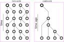{width=100%}

## Forwards or backwards?

Do your digital organisms:

> - have at most one site under selection?
> - live in a collection of randomly-mating populations?
> - not need some specific life cycle?

. . .

If so, then
*coalescent simulation*
is the way to go!


# msprime


::: {.floatright}
{width=50%}


:::: {.caption}
[Kelleher, Etheridge, & McVean 2016](http://journals.plos.org/ploscompbiol/article?id=10.1371/journal.pcbi.1004842) 
::::
:::


## msprime v1.0

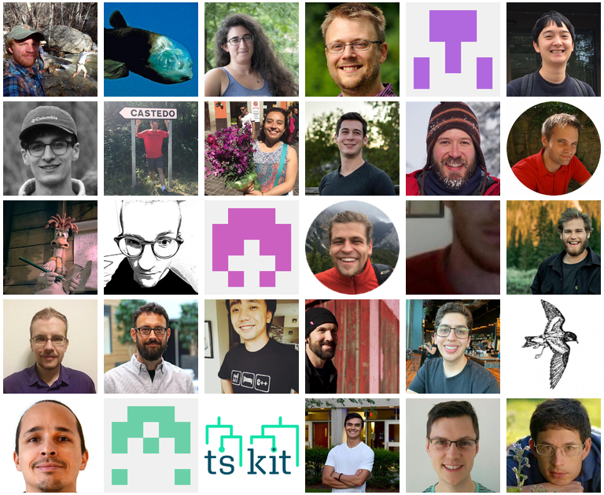

## New features:

::: {.columns}
:::::: {.column}

- $k$-ploid individuals, finite sites

::: {.hide}
- recombination rate maps
- gene conversion
- nicer demographic model specification
- mutation rate maps
- quick analysis
:::

:::
:::::: {.column width=50%}


:::
::::::

## New features:

::: {.columns}
:::::: {.column}

- $k$-ploid individuals, finite sites
- recombination rate maps

::: {.hide}
- gene conversion
- nicer demographic model specification
- mutation rate maps
- quick analysis
:::

:::
:::::: {.column width=50%}


:::
::::::

## New features:

::: {.columns}
:::::: {.column}

- $k$-ploid individuals, finite sites
- recombination rate maps
- gene conversion

::: {.hide}
- nicer demographic model specification
- mutation rate maps
- quick analysis
:::

:::
:::::: {.column width=50%}


:::
::::::


## New features:

::: {.columns}
:::::: {.column}

- $k$-ploid individuals, finite sites
- recombination rate maps
- gene conversion
- nicer demographic model specification

::: {.hide}
- mutation rate maps
- quick analysis
:::

:::
:::::: {.column width=50%}

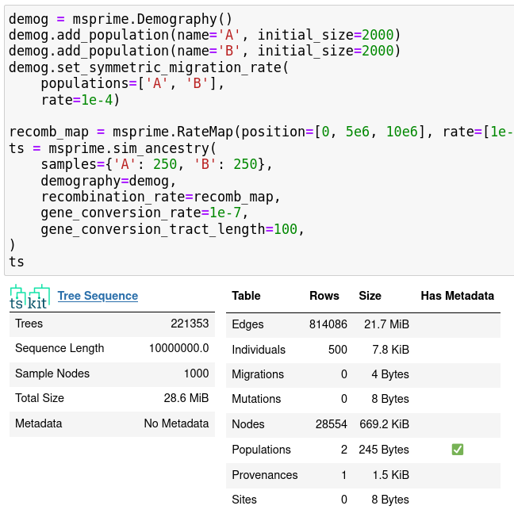

:::
::::::

## New features:

::: {.columns}
:::::: {.column}

- $k$-ploid individuals, finite sites
- recombination rate maps
- gene conversion
- nicer demographic model specification
- mutation rate maps

::: {.hide}
- quick analysis
:::

:::
:::::: {.column width=50%}

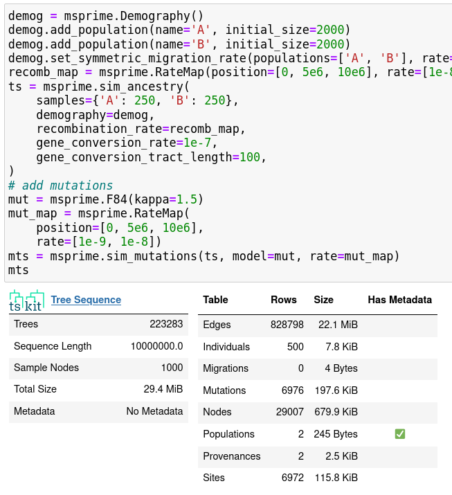

:::
::::::

## New features:

::: {.columns}
:::::: {.column}

- $k$-ploid individuals, finite sites
- recombination rate maps
- gene conversion
- nicer demographic model specification
- mutation rate maps
- quick analysis

:::
:::::: {.column width=50%}

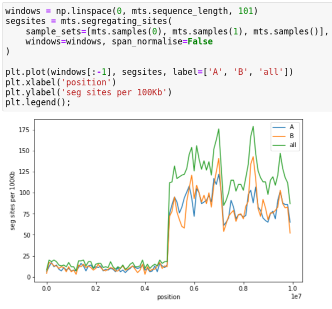

:::
::::::


## Ancestry models

::: {.columns}
:::::: {.column width=40%}

- "the" coalescent
- discrete-time Wright-Fisher
- multiple mergers
- selective sweeps

:::
:::::: {.column width=60%}

::: {.small}

```
sweep_model = msprime.SweepGenicSelection(
    position=2.5e4, s=0.01,
    start_frequency=0.5e-4, end_frequency=0.99, dt=1e-6)
sts = msprime.sim_ancestry(9,
    model=[sweep_model, msprime.StandardCoalescent()],
    population_size=1e4, recombination_rate=1e-8, sequence_length=5e4)
```

:::

:::
::::::


## Mutation models

::: {.columns}
:::::: {.column width=40%}

- infinite sites/alleles
- nucleotides
- amino acids
- arbitrary Markovian models

:::
:::::: {.column width=60%}

::: {.small}
```
dem = msprime.Demography.from_species_tree(
   "((A:900,B:900)ab:100,C:1000)abc;",
   initial_size=1e3)
samples = {"A": 2, "B": 1, "C": 1}
ts = msprime.sim_ancestry(
   8, demography=dem, sequence_length=5e4,
   recombination_rate=1e-8
)
mts = msprime.sim_mutations(ts, rate=1e-7)
mts.draw_svg()
```
:::

:::
::::::


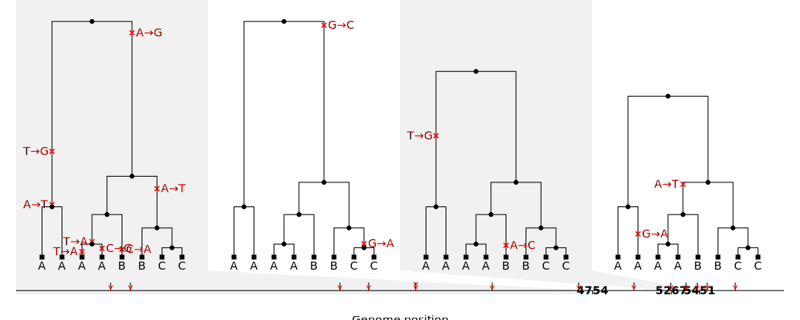

# SLiMv3 {data-background-image="figs/slim_screenshot.png" data-background-position=left data-background-size=100%}

## An eco-evolutionary simulator

::: {.columns}
:::::: {.column}

- everything msprime can
- ecological dynamics with "non-Wright-Fisher" models
- populations in continuous, heterogeneous geography
- sex chromosomes, haplodiploidy
- complex traits
- context-dependent mutations
- **v4:** interacting species

:::
:::::: {.column width=50%}


{width=60%}

:::{.caption .floatright}
{width=90%}

Ben Haller
:::


:::
::::::


## {data-background-image="figs/slim_manual.png" data-background-position=left data-background-size=50%}

::: {.columns}
:::::: {.column width=60%}

:::
:::::: {.column width=40%}

**Getting started:**

1. read the introduction of the SLiM manual
2. find a recipe that's close to what you want
3. open up the GUI and try it
4. print stuff in the console
5. add in other bits
6. take a workshop!


:::
::::::

# tree sequences

{width=30%}

::: {.floatright}
{width=50%}


:::: {.caption}
[Kelleher, Etheridge, & McVean 2016](http://journals.plos.org/ploscompbiol/article?id=10.1371/journal.pcbi.1004842) 
::::
:::

-------


## Development philosophy

::: {.columns}
:::::: {.column width=50%}

- open, welcoming, supportive
- well-documented
- reliable, reproducible
- backwards compatible

:::
:::::: {.column width=50%}

{width=80%}

*tskit*: the tree sequence toolkit

::: {.floatright}
[https://tskit.dev](https://tskit.dev)
:::

:::
::::::


## The tree sequence


:::: {.caption}
*video credit: Yan Wong*
::::

## Benefits

::: {.columns}
:::::: {.column}

- extremely efficient for large simulations
- retains genotypes *and* genealogical history

Interoperable: now supported by

- [msprime](https://tskit.dev/msprime/docs/stable/intro.html)
- [SLiM](https://messerlab.org/SLiM)
- [fwdpy11](https://molpopgen.github.io/fwdpy11/intro.html)
- [Gspace](http://www1.montpellier.inra.fr/CBGP/software/gspace/download.html)
- [geonomics](https://geonomics.readthedocs.io/en/latest/)

:::
:::::: {.column width=50%}

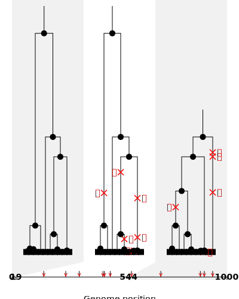

:::
::::::


## Post-hoc mutations

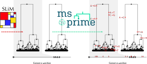

## Recapitation


# Runtime

::: {.columns}
:::::: {.column width=40%}

- $N_e$ = population size
- $L$ = genome length
- $T$ = # of generations
- sample size doesn't matter
- "chromosome" = $10^8$ bp

:::
:::::: {.column width=60%}


- `msprime`: quadratic in $N_e L$

    * chromosomes, $N_e = 1,000$: seconds
    * megabases, $N_e = 100,000$: seconds
    * chromosomes, $N_e = 100,000$: hours
    * megabases, $N_e = 10,000,000$: hours

:::
::::::

::: {.columns}
:::::: {.column width=20%}

:::
:::::: {.column width=60%}

- `SLiM`: linear in $N_e T$

    * $N_e = 1,000$: seconds/thousand gens
    * $N_e = 100,000$: minutes/thousand gens
    * selection: 3x slower
    * space: 10x slower with neighborhood size 20

:::
:::::: {.column width=20%}

:::
::::::


## How long do I run it for?

> 1. Until equilibrium. (4N? 20N?)
> 2. If that's too long, for a "while", and recapitate.
> 3. Your results shouldn't depend too much on how you do it.

. . .

Big picture: how accurate do you think your demographic model
    reflects 2N generations ago, really?

## Considerations

- $N$ = population size
- $L$ = genome length
- sample size (doesn't matter much)
- number of generations (SLiM only)
- selection
- geography
- adding neutral mutations (nearly instant)

## msprime: 1000 samples

{width=80%}

*takeaway:* hundreds of thousands of megabases takes seconds

## msprime: 1000 samples

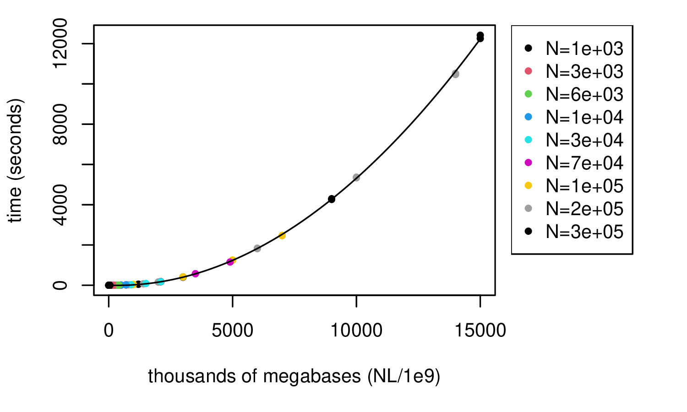{width=80%}

*takeaway:* hundreds of thousands of megabases takes seconds

## basic demography: SLiM

{width=80%}

*takeaway:* linear in population size

## Basic demography: SLiM

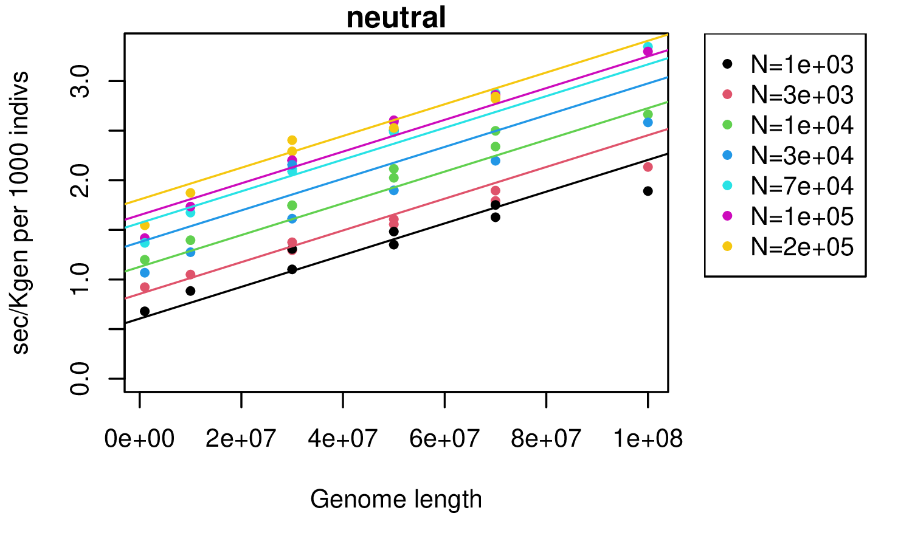{width=80%}

*takeaway:* seconds per thousand individuals per thousand generations

## Selection: SLiM, total rate $10^{-10}$

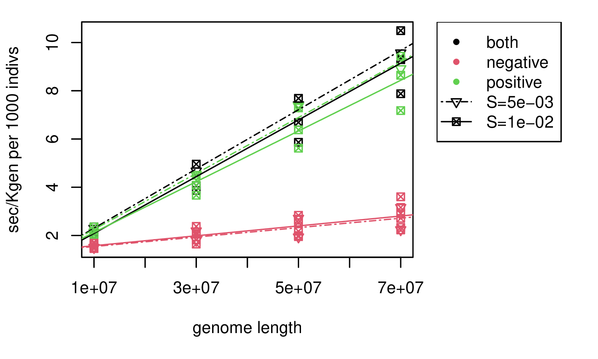{width=80%}

*takeaway:* similar, but slower by a factor of 3 for lots of positive mutations

## Spatial simulations: SLiM

{width=80%}

*takeaway:* 3x slower than genomes!
Scales with neighborhood size ($\sigma^2$).


# Thanks!

::: {.columns}
:::::: {.column}

{ width=30% }


:::
:::::: {.column width=50%}

{width=50%}

- Jerome Kelleher
- Ben Haller
- Ben Jeffery
- Yan Wong
- Murillo Rodrigues
- Andy Kern
- Philipp Messer

[https://tskit.dev/](https://tskit.dev/)

:::
::::::


## How to get help

- SLiM: [the mailing list](https://groups.google.com/forum/#!forum/slim-discuss)

- msprime/tskit: ["discussions" on github](https://github.com/tskit-dev/msprime/discussions)

- Get involved! Suggest features, write documentation, write code...

