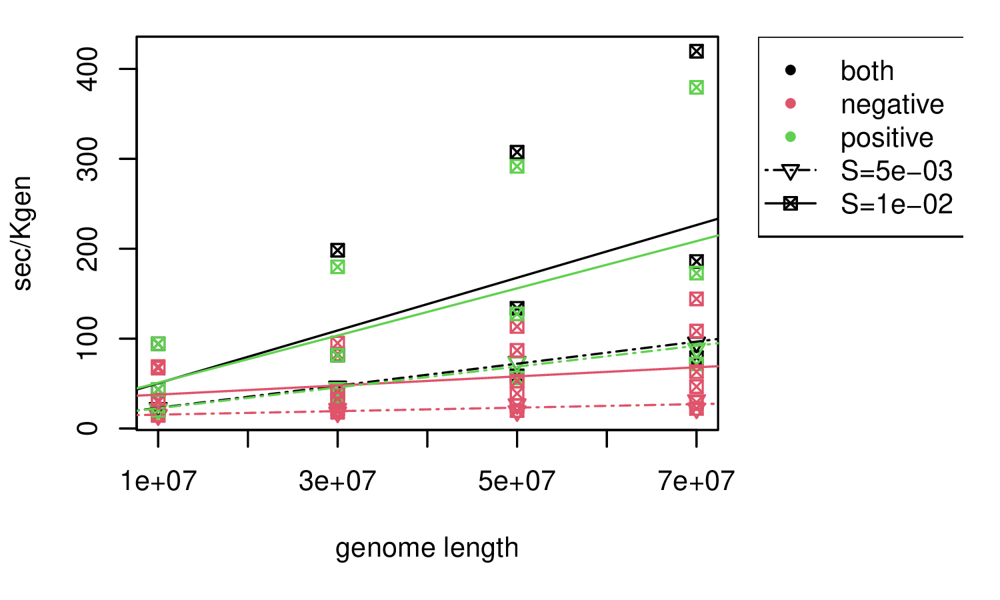

# Overview of simulators

<!--
- overview of simulators and development
- background on forwards vs coalescent
- bullet points of features
- tree sequences: adding neutral mutations afterwards
- benchmarking for "plain vanilla": how many individuals and how long a genome?
- benchmarking for adding selection to (4) as a function of how much selection
- benchmarking for spatial nonWF: as a function of neighborhood size
- recapitation best practices
-->

*In this talk:*

::: {.columns}
:::::: {.column width=50%}

- msprime: a coalescent simulator
- SLiM: a forwards simulator

. . .

Other good ones:

- [Gspace](http://www1.montpellier.inra.fr/CBGP/software/gspace/download.html)
- [geonomics](https://geonomics.readthedocs.io/en/latest/)
- [simbit](LINK)
- [fastsimcoal](LINK)
- [SFS_CODE](LINK)

:::
:::::: {.column width=50%}

{width=80%}

{width=100%}

:::
::::::

## Development philosophy

::: {.columns}
:::::: {.column width=50%}

- open, welcoming, supportive
- well-documented
- reliable, reproducible
- backwards compatible

:::
:::::: {.column width=50%}

{width=80%}

*tskit*: the tree sequence toolkit

::: {.floatright}
[tskit.dev](tskit.dev)
:::

:::
::::::

## Forwards or backwards?

::: {.columns}
:::::: {.column width=50%}

diagram of forwards simulation

::: 
:::::: {.column width=50%}

diagram of coalescent simulation

:::
:::::: 

## Forwards or backwards?

Do your digital organisms:

> - have at most one site under selection?
> - live in a collection of randomly-mating populations?
> - not need some specific life cycle?

. . .

If so, then
*coalescent simulation*
is the way to go!

# msprime

::: {.floatright}
{width=50%}

:::: {.caption}
[Kelleher, Etheridge, & McVean](http://journals.plos.org/ploscompbiol/article?id=10.1371/journal.pcbi.1004842) 
::::
:::

## msprime v1.0

## New features:

- finite sites
- recombination rate maps
- mutation rate maps
- gene conversion
- nicer demographic model specification

## Ancestry models

- "the" Kingman/Hudson coalescent
- discrete-time Wright-Fisher
- selective sweeps
- multiple mergers

## Mutation models

::: {.columns}
:::::: {.column width=50%}

- infinite sites/alleles
- nucleotides
- amino acids

:::
:::::: {.column width=50%}

:::
::::::

# SLiM

## An eco-evolutionary simulator

- ecological dynamics with "non-Wright-Fisher" models
- populations in continuous, heterogeneous geography
- sex chromosomes, haplodiploidy
- complex traits
- context-dependent mutations

##

for instance:
image of local adaptation

## {data-background-image="figs/slim_manual.png" data-background-position=left data-background-size=50%}

::: {.columns}
:::::: {.column width=60%}

:::
:::::: {.column width=40%}

**Getting started:**

1. read the introduction of the SLiM manual (chapters 1 & 3)
2. find a recipe that's close to what you want to do
3. open up the GUI and try it out

4. print stuff out in the Eidos console
5. add in bits from other recipes

6. take a workshop!

:::
::::::

# tree sequences

## The tree sequence

:::: {.caption}
*video credit: Yan Wong*
::::

## Benefits of interoperability

- recapitate with msprime
- Add mutations with msprime
- interleave the two

(figure)

##

Now also supported by

- [Gspace](http://www1.montpellier.inra.fr/CBGP/software/gspace/download.html)
- [geonomics](https://geonomics.readthedocs.io/en/latest/)

# Runtime

## msprime

## basic demography: SLiM

seconds per thousand individuals per thousand generations

## selection

seconds per thousand individuals per thousand generations per megabase of genome

## spatial simulations:

depends a lot on neighborhood size

# Best practices

## How long to run it for?

what is equilibrium?

when is recapitation ok?

## How to get help

- SLiM: the mailing list

- msprime/tskit: "discussion" on github

