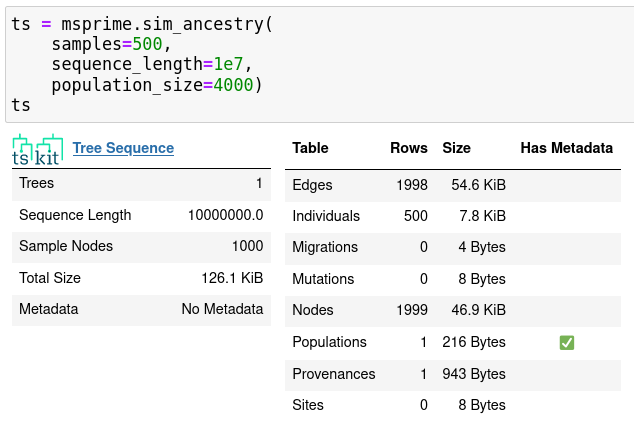
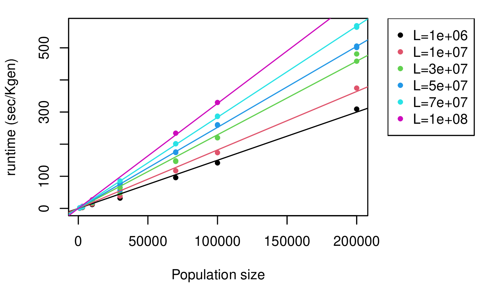
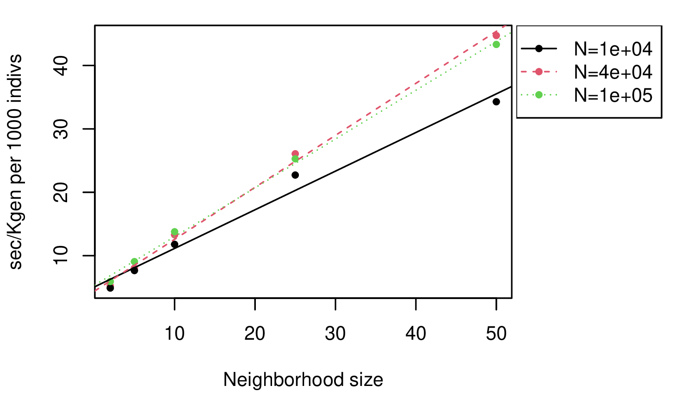

# Overview of simulators

<!--
- overview of simulators and development
- background on forwards vs coalescent
- bullet points of features
- tree sequences: adding neutral mutations afterwards
- benchmarking for "plain vanilla": how many individuals and how long a genome?
- benchmarking for adding selection to (4) as a function of how much selection
- benchmarking for spatial nonWF: as a function of neighborhood size
- recapitation best practices
-->


*In this talk:*

::: {.columns}
:::::: {.column width=50%}

- msprime: a coalescent simulator
- SLiM: a forwards simulator

. . .

Other good ones:

- [Gspace](http://www1.montpellier.inra.fr/CBGP/software/gspace/download.html)
- [geonomics](https://geonomics.readthedocs.io/en/latest/)
- [simbit](LINK)
- [fastsimcoal](LINK)
- [SFS_CODE](LINK)

:::
:::::: {.column width=50%}


{width=80%}

{width=100%}

:::
::::::


## Development philosophy

::: {.columns}
:::::: {.column width=50%}

- open, welcoming, supportive
- well-documented
- reliable, reproducible
- backwards compatible

:::
:::::: {.column width=50%}

{width=80%}

*tskit*: the tree sequence toolkit

::: {.floatright}
[tskit.dev](https://tskit.dev)
:::

:::
::::::


## Forwards or backwards?

::: {.columns}
:::::: {.column width=50%}

diagram of forwards simulation

::: 
:::::: {.column width=50%}

diagram of coalescent simulation

:::
:::::: 

## Forwards or backwards?

Do your digital organisms:

> - have at most one site under selection?
> - live in a collection of randomly-mating populations?
> - not need some specific life cycle?

. . .

If so, then
*coalescent simulation*
is the way to go!


# msprime


::: {.floatright}
{width=50%}


:::: {.caption}
[Kelleher, Etheridge, & McVean](http://journals.plos.org/ploscompbiol/article?id=10.1371/journal.pcbi.1004842) 
::::
:::


## msprime v1.0


## New features:

::: {.columns}
:::::: {.column}

- $k$-ploid individuals, finite sites

::: {.hide}
- recombination rate maps
- gene conversion
- nicer demographic model specification
- mutation rate maps
- quick analysis
:::

:::
:::::: {.column width=50%}



:::
::::::

## New features:

::: {.columns}
:::::: {.column}

- $k$-ploid individuals, finite sites
- recombination rate maps

::: {.hide}
- gene conversion
- nicer demographic model specification
- mutation rate maps
- quick analysis
:::

:::
:::::: {.column width=50%}


:::
::::::

## New features:

::: {.columns}
:::::: {.column}

- $k$-ploid individuals, finite sites
- recombination rate maps
- gene conversion

::: {.hide}
- nicer demographic model specification
- mutation rate maps
- quick analysis
:::

:::
:::::: {.column width=50%}


:::
::::::


## New features:

::: {.columns}
:::::: {.column}

- $k$-ploid individuals, finite sites
- recombination rate maps
- gene conversion
- nicer demographic model specification

::: {.hide}
- mutation rate maps
- quick analysis
:::

:::
:::::: {.column width=50%}


:::
::::::

## New features:

::: {.columns}
:::::: {.column}

- $k$-ploid individuals, finite sites
- recombination rate maps
- gene conversion
- nicer demographic model specification
- mutation rate maps

::: {.hide}
- quick analysis
:::

:::
:::::: {.column width=50%}


:::
::::::

## New features:

::: {.columns}
:::::: {.column}

- $k$-ploid individuals, finite sites
- recombination rate maps
- gene conversion
- nicer demographic model specification
- mutation rate maps
- quick analysis

:::
:::::: {.column width=50%}


:::
::::::


## Ancestry models

::: {.columns}
:::::: {.column width=40%}

- "the" coalescent
- discrete-time Wright-Fisher
- selective sweeps
- multiple mergers

:::
:::::: {.column width=60%}

::: {.small}

```
sweep_model = msprime.SweepGenicSelection(
    position=2.5e4, s=0.01,
    start_frequency=0.5e-4, end_frequency=0.99, dt=1e-6)
sts = msprime.sim_ancestry(9,
    model=[sweep_model, msprime.StandardCoalescent()],
    population_size=1e4, recombination_rate=1e-8, sequence_length=5e4)
```

:::

:::
::::::


## Mutation models

::: {.columns}
:::::: {.column width=40%}

- infinite sites/alleles
- nucleotides
- amino acids

:::
:::::: {.column width=60%}

::: {.small}
```
dem = msprime.Demography.from_species_tree(
   "((A:900,B:900)ab:100,C:1000)abc;",
   initial_size=1e3)
samples = {"A": 2, "B": 1, "C": 1}
ts = msprime.sim_ancestry(
   8, demography=dem, sequence_length=5e4,
   recombination_rate=1e-8
)
mts = msprime.sim_mutations(ts, rate=1e-7)
mts.draw_svg()
```
:::

:::
::::::


# SLiM


## An eco-evolutionary simulator

- ecological dynamics with "non-Wright-Fisher" models
- populations in continuous, heterogeneous geography
- sex chromosomes, haplodiploidy
- complex traits
- context-dependent mutations

##

for instance:
image of local adaptation


## {data-background-image="figs/slim_manual.png" data-background-position=left data-background-size=50%}

::: {.columns}
:::::: {.column width=60%}

:::
:::::: {.column width=40%}

**Getting started:**

1. read the introduction of the SLiM manual (chapters 1 & 3)
2. find a recipe that's close to what you want to do
3. open up the GUI and try it out


4. print stuff out in the Eidos console
5. add in bits from other recipes

6. take a workshop!


:::
::::::

# tree sequences


## The tree sequence


:::: {.caption}
*video credit: Yan Wong*
::::

## Benefits

- extremely efficient for large simulations
- retains genotypes *and* genealogical history

Interoperable: now supported also by

- [Gspace](http://www1.montpellier.inra.fr/CBGP/software/gspace/download.html)
- [geonomics](https://geonomics.readthedocs.io/en/latest/)

(figure)

## Post-hoc mutations

(figure of adding mutations to the trees)

## Recapitation

(figure of this)

## Joining separate simulations with common history

(figure of this)

# Runtime

## Considerations

- $N$ = population size
- $L$ = genome length
- sample size (doesn't matter much)
- number of generations (SLiM only)
- selection
- geography
- adding neutral mutations (nearly instant)

## msprime: 1000 samples


*takeaway:* hundreds of thousands of megabases takes seconds

## msprime: 1000 samples


*takeaway:* hundreds of thousands of megabases takes seconds

## basic demography: SLiM



*Note:* with **no** mutations

## Basic demography: SLiM


*takeaway:* seconds per thousand individuals per thousand generations

## Selection: SLiM, total rate $10^{-10}$


*takeaway:* similar, but slower by a factor of 3 for lots of positive mutations

## Spatial simulations: SLiM



*takeaway:* Slower than genomes!
Scales with neighborhood size ($\sigma^2$).

# Best practices

## How long to run it for?

what is equilibrium?

when is recapitation ok?

## How to get help

- SLiM: the mailing list

- msprime/tskit: "discussion" on github

